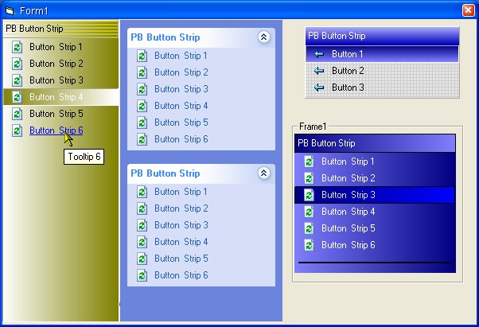



## PB Button Strip Control Updated 5/23/2002

### Description

A Strip of option buttons, Features 5 control border styles, 4 caption border styles, 4 caption styles, 3 buttons styles, inc Windows XP Style Side Menus

Tile a picture to the background & Change the Font of the caption & buttons

Update added tooltip support
 
### More Info
 

             |
---                |---
**Submitted On**   |2002-05-23 12:18:58
**By**             |[Paul B1](https://github.com/Planet-Source-Code/PSCIndex/blob/master/ByAuthor/paul-b1.md)
**Level**          |Advanced
**User Rating**    |4.9 (44 globes from 9 users)
**Compatibility**  |VB 6\.0
**Category**       |[Complete Applications](https://github.com/Planet-Source-Code/PSCIndex/blob/master/ByCategory/complete-applications__1-27.md)
**World**          |[Visual Basic](https://github.com/Planet-Source-Code/PSCIndex/blob/master/ByWorld/visual-basic.md)
**Archive File**   |[PB\_Button\_861905232002\.zip](https://github.com/Planet-Source-Code/paul-b1-pb-button-strip-control-updated-5-23-2002__1-35000/archive/master.zip)

### API Declarations

Lots of them

